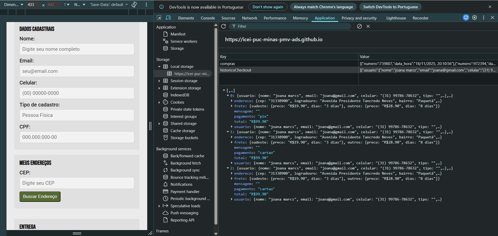
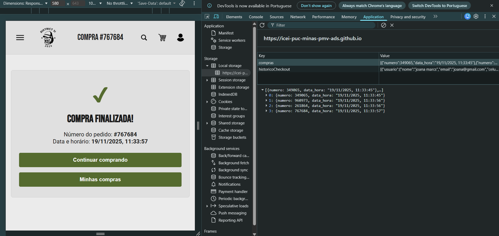
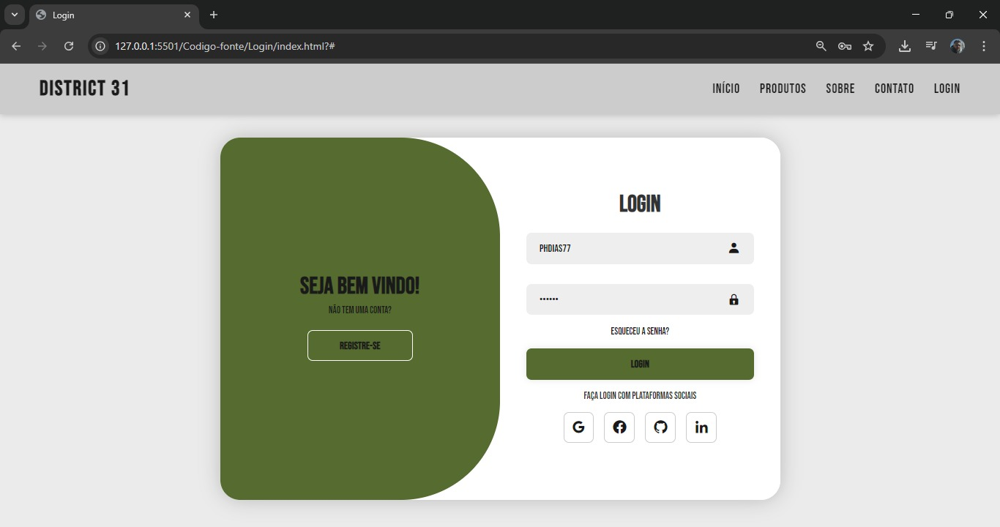

# Registro de Testes de Software

Pré-requisitos: Projeto de Interface, Plano de Testes de Software

Os testes funcionais realizados na aplicação web são descritos a seguir.

## Checkout

  <li> CT-01: Verificar cálculo de frete por CEP.

  Responsável: Isabella

https://github.com/user-attachments/assets/3fda6887-82c7-477a-b1d8-6707487ce5e4

</li>

<li> CT-02: Verificar finalização de compra.
    
  Responsável: Isabella

https://github.com/user-attachments/assets/9ff90af2-7ea9-4465-8c70-9886b182f5b7

</li>

  <li> CT-03: Verificar armazenamento local de dados do checkout
    
  Responsável: Isabella

</li>

## Compra Finalizada

  <li> CT-01: Verificar exibição das informações do pedido
    
  Responsável: Isabella

https://github.com/user-attachments/assets/00902d9e-202b-488d-892e-73e3fde349a7

</li>

  <li> CT-02: Verificar armazenamento local de dados do horário/data e número do pedido
    
  Responsável: Isabella

  
  </li>
 
  
## Login

  <li> CT-01: Verificar se os dados estao preenchidos
    
  Responsável: Phillipe

</li>

  <li> CT-02: Verificar armazenamento local de dados do horário/data

 

 <li> CT-03: Verificar se os dados estao preenchidos
    
  Responsável: Phillipe

</li>

<li> CT-04: Verificar se os dados estao preenchidos
    
  Responsável: Phillipe

</li>

## Seleção do produto 

  <li> CT-01: Verifique o funcionamento da Tela de Produto

  Responsável: Vitoria Ribeiro 

  https://github.com/user-attachments/assets/082cd624-80fe-47ea-9a15-1affaba00e0c

   <li> CT-02: Verifique o Simulação de frete por CEP

  Responsável: Vitoria Ribeiro 

  https://github.com/user-attachments/assets/20a5551a-2335-4f64-a43a-72acf6371c0b

   <li> CT-03: Verifique o armazenamento de dados no LocalStorage

  Responsável: Vitoria Ribeiro 

  https://github.com/user-attachments/assets/59e281fe-2993-40c5-8bf0-ca67c06803a2

## Carrinho de compra

<li>CT-01: Adicionar e remover a quantidade do mesmo produto.

[CT-01(Ver vídeo)](https://raw.githubusercontent.com/gabrielfchavesc/pmv-ads-2025-2-e1-proj-web-t8-loja-online/Documentos/img/carrinhoQuantidade.mp4)

  Responsável : Gabriel Felipe e Gabriel Passos.

</li>

<li>CT-02: Remover produto do carrinho.

[CT-02(Ver vídeo)](https://raw.githubusercontent.com/gabrielfchavesc/pmv-ads-2025-2-e1-proj-web-t8-loja-online/Documentos/img/carrinhoRemover.mp4)

   Responsável : Gabriel Felipe e Gabriel Passos.

</li>

<li>CT-03: Cálculo final do carrinho.

[CT-03(Ver vídeo)](https://raw.githubusercontent.com/gabrielfchavesc/pmv-ads-2025-2-e1-proj-web-t8-loja-online/Documentos/img/carrinhoQuantidade.mp4)

   Responsável : Gabriel Felipe e Gabriel Passos.

</li>

  
    
 

  
 

  

  
