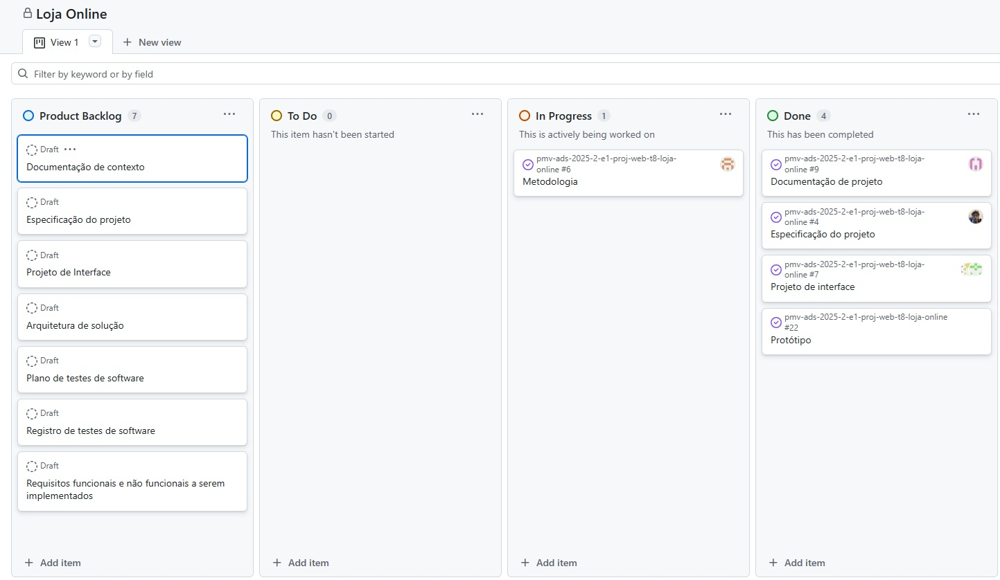
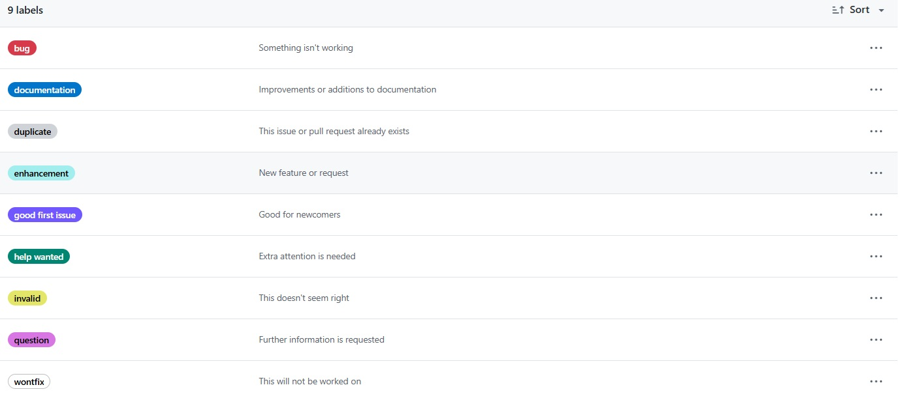

# Metodologia

## Gerenciamento de Projeto

A metodologia adotada para o desenvolvimento da Loja Online é o Scrum, um framework ágil amplamente aplicado em projetos de software por permitir entregas iterativas e incrementais, com foco constante na adaptação e no valor entregue ao usuário.
De acordo com Schwaber e Sutherland (2020, p. 3), no Guia do Scrum (versão oficial em português, traduzida por Fábio Cruz, Eduardo Rodrigues Sucena e Rodrigo Paulo):

“O Scrum é um framework leve que ajuda pessoas, times e organizações a gerar valor por meio de soluções adaptativas para problemas complexos.”

Essa abordagem foi escolhida porque favorece ciclos curtos de desenvolvimento, maior colaboração entre os membros da equipe e flexibilidade para incorporar ajustes ao longo do projeto.

### Divisão de Papéis

A equipe foi organizada conforme os papéis principais do Scrum:
<ul>
<li>Scrum Master: Phillipe Dias</li>
<li>Product Owner: Isabella Lima</li>
<li>Equipe de Desenvolvimento: Gabriel Felipe, Gabriel Passos, Matheus Valadares</li>
<li>Equipe de Design: Vitoria Ribeiro</li>
</ul>

### Processo

Para acompanhamento das atividades, a equipe utiliza um quadro kanban no GitHub Projects, dividido em listas que representam o fluxo de trabalho:
<ul>
<li>Product Backlog: reúne todas as funcionalidades e melhorias levantadas ao longo do projeto.</li>
<li>To Do: tarefas selecionadas para o Sprint atual.</li>
<li>In Progress: atividades em andamento.</li>
<li>Done: tarefas concluídas, testadas e prontas para entrega.</li>
</ul>
Esse processo garante transparência no progresso, comunicação clara e controle de qualidade sobre cada entrega.  

O quadro kanban do grupo no GitHub está disponível no link https://github.com/orgs/ICEI-PUC-Minas-PMV-ADS/projects/2338 e é apresentado, no estado atual, na figura abaixo:

Figura 1 - Tela do kanban no GitHub utilizada pelo grupo

### Etiquetas
As tarefas são classificadas por etiquetas, de acordo com sua natureza, para facilitar a priorização e a organização:
<ul>
<li>Bug – algo não está funcionando.</li>
<li>Documentação (Documentation) – melhorias ou adições na documentação.</li>
<li>Duplicado (Duplicate) – esta issue ou pull request já existe.</li>
<li>Funcionalidade (Enhancement) – nova funcionalidade ou solicitação.</li>
<li>Boa primeira issue (Good first issue) – bom para iniciantes.</li>
<li>Ajuda necessária (Help wanted) – atenção extra é necessária.</li>
<li>Inválido (Invalid) – isso não parece correto.</li>
<li>Pergunta (Question) – mais informações são necessárias.</li>
<li>Não será corrigido (Wontfix) – isso não será resolvido.</li>
</ul>

Figura 2 - Tela do esquema de cores e categorias
  
### Ferramentas

As ferramentas foram selecionadas para dar suporte a todas as etapas do projeto:

- Editor de código: GitHub (editor online), utilizado para criar e editar arquivos diretamente na plataforma, em linguagem Markdown.
- Controle de versão e gerenciamento: GitHub, utilizado tanto para versionamento quanto para o acompanhamento via kanban.
- Comunicação: WhatsApp e Microsoft Teams, que permitem contato rápido e reuniões de alinhamento.
- Design e prototipagem: Figma, usado para wireframes e definição da identidade visual.

Os artefatos do projeto estão organizados da seguinte forma:

| AMBIENTE                            | PLATAFORMA                         | LINK DE ACESSO                         |
|-------------------------------------|------------------------------------|----------------------------------------|
| Repositório de código fonte         | GitHub                             | http://....                            |
| Documentos do projeto               | GitHub                             | https://github.com/ICEI-PUC-Minas-PMV-ADS/pmv-ads-2025-2-e1-proj-web-t8-loja-online                           |
| Projeto de Interface                | Figma                              | https://www.figma.com/design/u7EOKD4wNXMycSC1IDcfNk/Prot%C3%B3tipo-de-baixa-fidelidade?t=VAgOV0ieWNSvh1iz-1
| Projeto de Interface                | Canvas                             | https://www.canva.com/design/DAGzWGfcs-w/p38yovnkQRISdWUjsL7SuQ/edit?utm_content=DAGzWGfcs-w&utm_campaign=designshare&utm_medium=link2&utm_source=sharebutton
| Gerenciamento do Projeto            | GitHub Projects                    | https://github.com/orgs/ICEI-PUC-Minas-PMV-ADS/projects/2338                    |
| Hospedagem                          | GitHub Pages                       | http://....                            |

### Estratégia de Organização de Codificação 

O código-fonte da aplicação está estruturado em pastas no repositório GitHub, separando frontend, assets e arquivos de configuração. Essa divisão facilita a colaboração entre os membros da equipe, garante maior clareza na manutenção e possibilita evolução futura de forma organizada.

