# Projeto de Interface

## User Flow

O fluxograma apresentado na figura 1 mostra o fluxo de interação do usuário pelas telas do sistema e a figura 2, mostra o fluxo do administrador com o sistema. Cada uma das telas deste fluxo é detalhada na seção de Protótipo de baixa fidelidade que se segue. Para visualizar o protótipo interativo

Link:https://www.canva.com/design/DAGzWGfcs-w/p38yovnkQRISdWUjsL7SuQ/edit?utm_content=DAGzWGfcs-w&utm_campaign=designshare&utm_medium=link2&utm_source=sharebutton

Fig.1

Fig.2

# Protótipo de baixa fidelidade

## User

O fluxograma apresentado na figura 1 mostra o fluxo de interação do Usuário pelas telas do sistema.
	
Fig.1
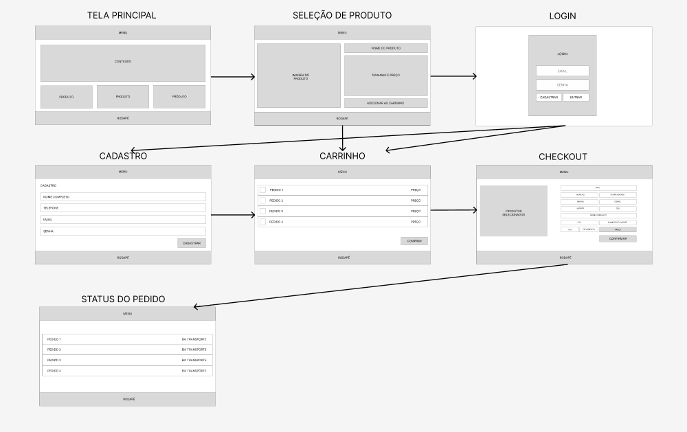

### Telas do usuário

As telas do usuário mostra o fluxo de uso do sistema.

Fig.2
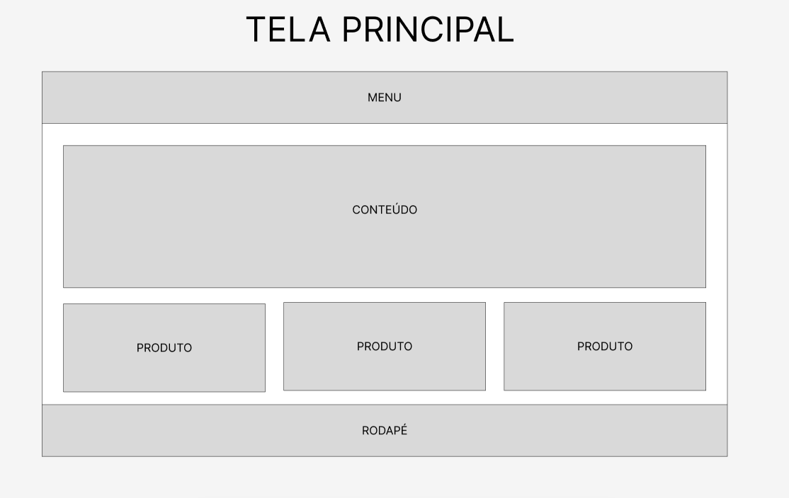

A figura 2 mostra a primeira tela com a qual o usuário tem o contato.

Fig.3
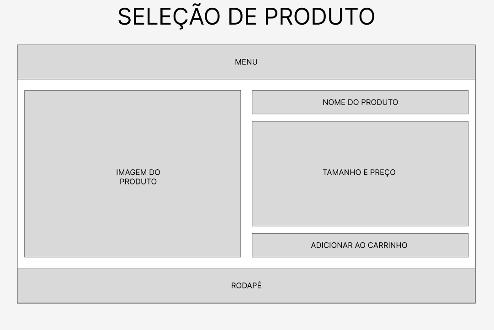

A figura 3 mostra a tela quando o produto já foi selecionado.

Fig.4
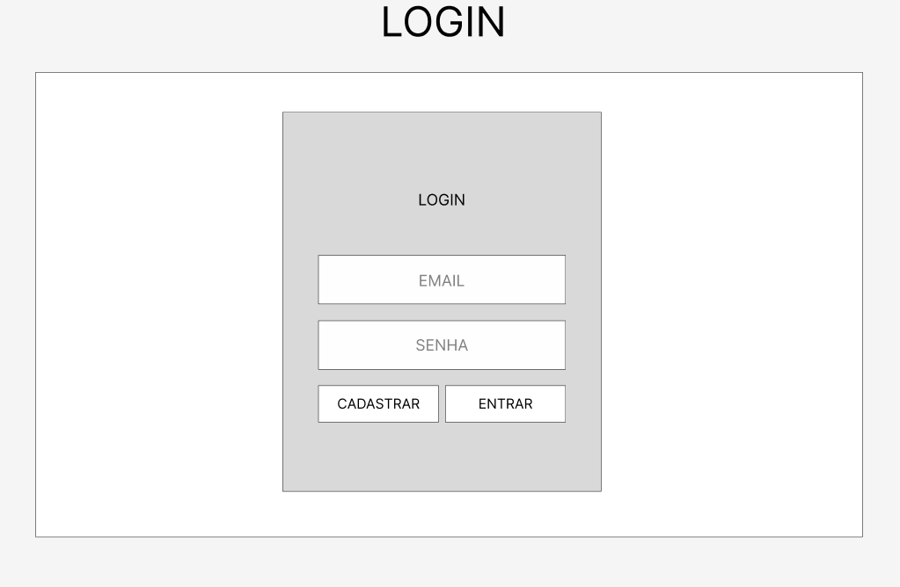

A figura 4 mostra a tela de login para entrar e poder realizar as compras.

Fig.5
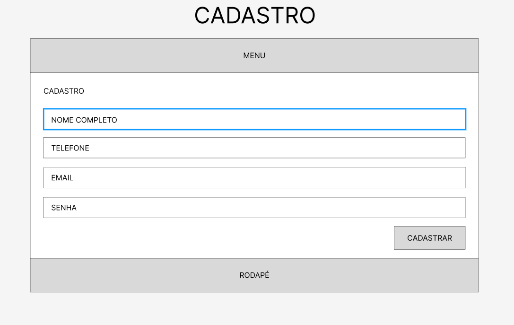

A figura 5 mostra a tela de cadastro para caso o cliente ainda não tenha o relizado.

Fig.6
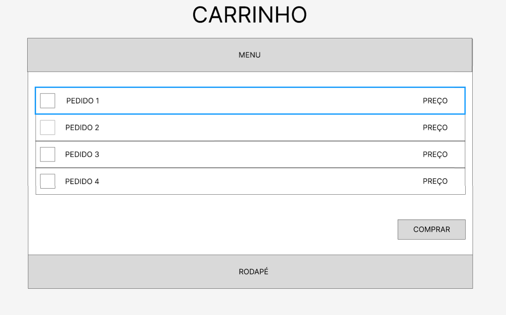

A figura 6 mostra a tela de carrinho para o usuário poder selecionar quais produtos quer de fato comprar.

Fig.7
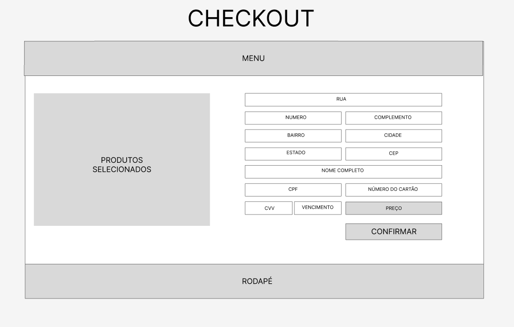

A figura 7 mostra o checkout para poder preencher os dados de pagamento e endereço para poder finalizar o pedido.

Fig.8
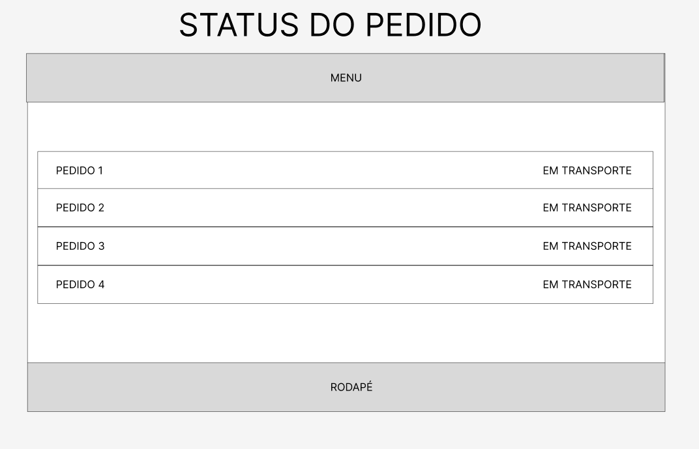

A figura 8 mostra o status de pedido que o usuário tenha comprado.

## Adm.

O fluxograma apresentado na figura 9 mostra o fluxo de interação do Adm. pelas telas do sistema.

Fig.9
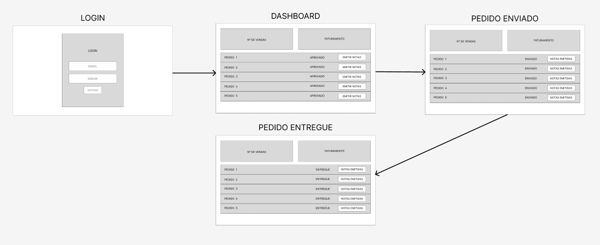

### Telas do Adm.

As telas do Adm. mostra o fluxo de uso do sistema.

Fig.10

A figura 10 mostra a tela de login do Adm. para poder entrar no sistema.

Fig.11
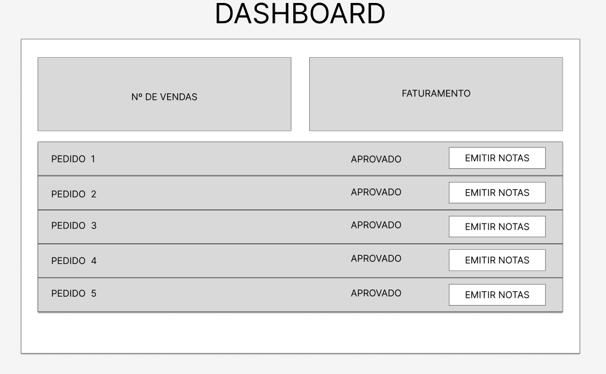

A figura 11 mostra a tela com o dashboard do Adm. onde mostram os pedidos a serem preparados e enviados.

Fig.12
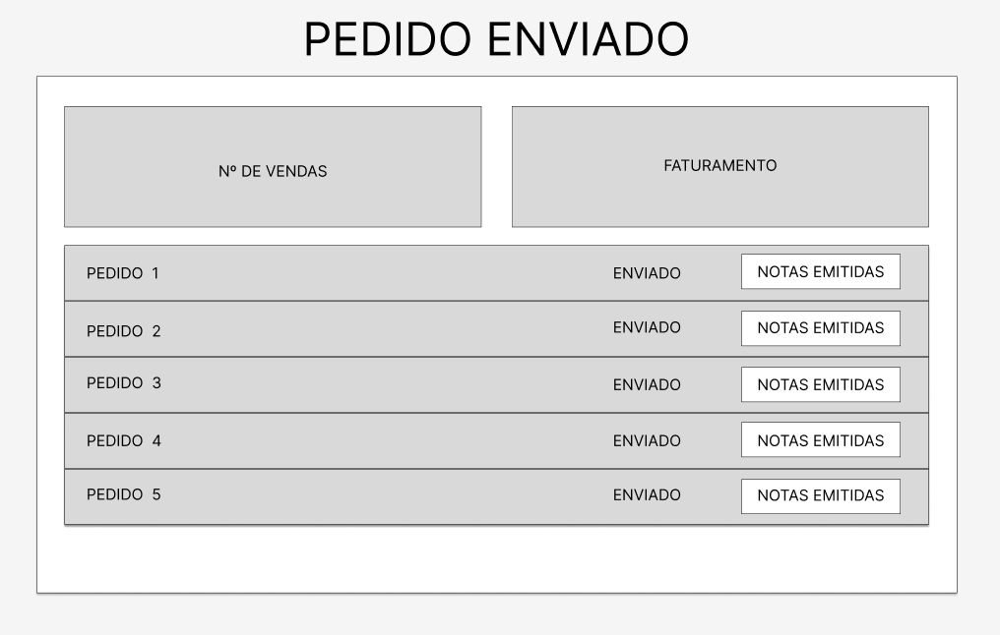

A figura 12 mostra a tela de status de pedido onde o produto já foi preparado e enviado a transportadora.

Fig.13
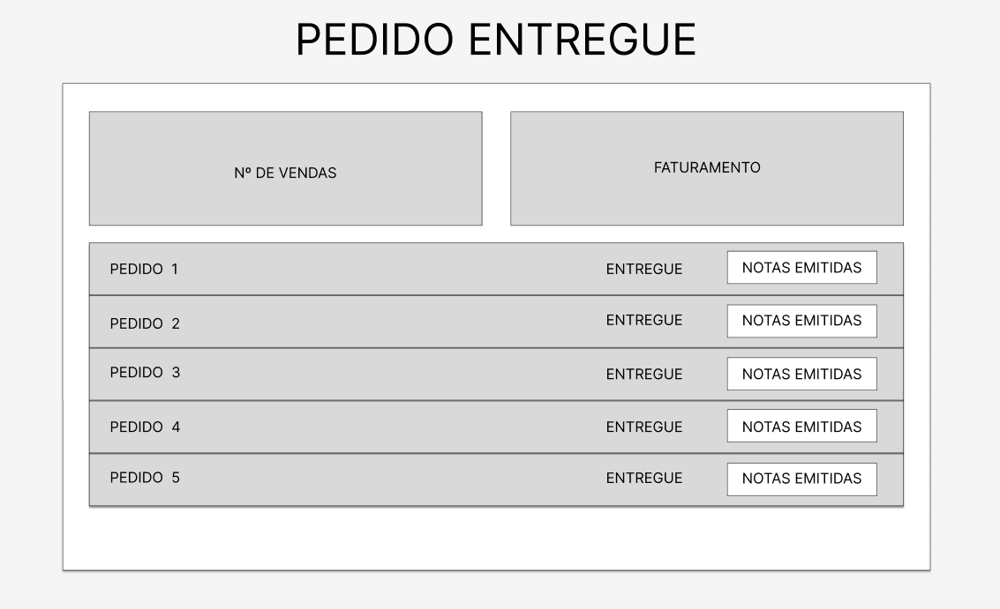

A figura 13 mostra a tela de status de pedido onde o produto já foi entregue ao cliente.

 

