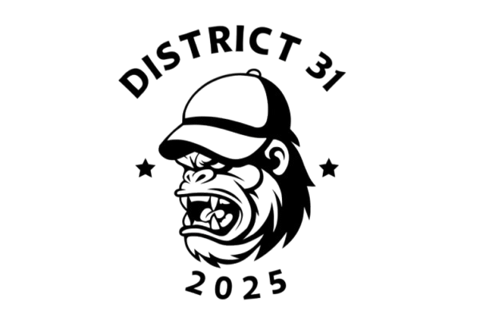

# Template Padrão da Aplicação 

O site da **District 31** foi desenvolvido utilizando **HTML**, **CSS** e **JavaScript**, unindo funcionalidade, desempenho e identidade visual.  
O layout segue uma estética inspirada na **cultura streetwear**, com um design moderno, limpo e responsivo, pensado para destacar os produtos e reforçar o estilo autêntico e urbano da marca.

---

## Elementos Padrão

Todas as páginas da aplicação compartilham uma estrutura consistente que garante harmonia visual e boa navegação:

- **Header** com o logotipo e o nome da loja.  
- **Menu de navegação** com links principais e barra de pesquisa integrada.  
- **Paleta de cores e tipografia** aplicadas de forma uniforme em botões, cards e textos.  
- **Logotipo sempre presente e visível**, reforçando o reconhecimento da marca.

---

## Tipografia

- **Bebas Neue** – usada em títulos e cabeçalhos, reforçando personalidade e atitude urbana.  
- **Roboto** – utilizada em textos corridos e descrições, garantindo leitura fluida e moderna.  

A identidade visual da District 31 combina tons neutros e acentos marcantes que traduzem **autenticidade, minimalismo e atitude** — elementos centrais da estética streetwear.

---

## Cores Principais que Compõem o Site

| Cor | Código | Uso |
|------|---------|-----|
| **Verde-oliva** | `#556B2F` | Cor principal da marca, usada em botões e destaques, transmitindo equilíbrio, confiança e estilo. |
| **Verde-hover** | `#6B8E23` | Realce suave para elementos interativos. |
| **Preto** | `#1A1A1A` | Utilizado no logotipo e textos principais, criando contraste e presença visual. |
| **Cinza médio** | `#E0E0E0` | Usado em cards e áreas secundárias, trazendo profundidade e suavidade. |
| **Cinza-claro de fundo** | `#EBEBEB` | Base neutra que valoriza os elementos visuais e os produtos. |
| **Branco** | `#FFFFFF` | Presente em textos, botões e ícones, garantindo clareza e equilíbrio. |

---

## Logotipo da District 31

O **logotipo** é um dos elementos centrais da identidade da marca.   
O **personagem estilizado com boné** reforça o conceito de **autenticidade, atitude e pertencimento** à cultura streetwear, enquanto o conjunto tipográfico **limpo e marcante** consolida a imagem **jovem e urbana** da marca.

