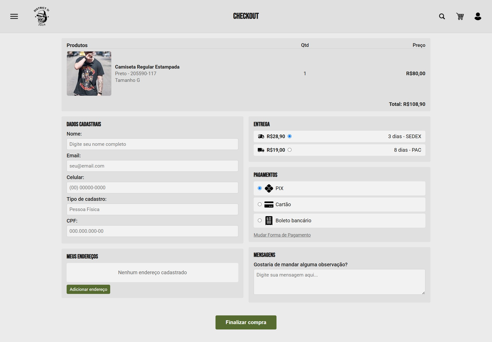
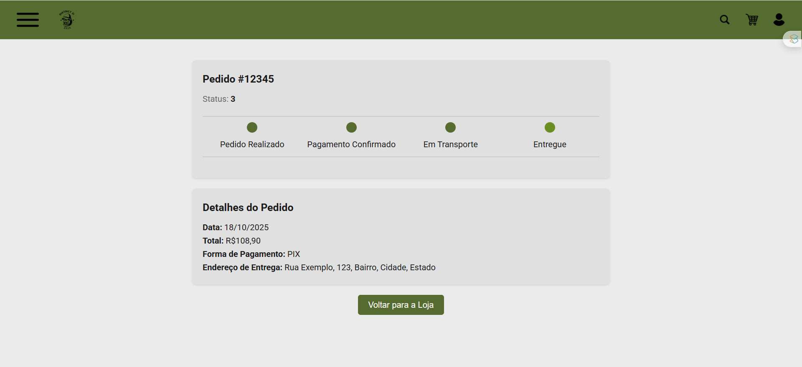

# Programação de Funcionalidades

### Tela de Checkout (RF-006)  
**Responsável:** Isabella Lima

**Descrição:**  
O acesso à tela de checkout é feito a partir do carrinho de compras. Essa tela permite ao usuário visualizar produtos, revisar quantidade e preço, preencher dados cadastrais, gerenciar endereços de entrega, selecionar forma de entrega e pagamento, adicionar observações e finalizar a compra. 

Exemplo da tela de checkout:

 

**Requisitos atendidos:**  
- RF-04: Adicionar, remover e atualizar itens no carrinho, com cálculo automático de totais.  
- RF-05: Calcular valor e prazo do frete por CEP, com simulação disponível sem login.  
- RF-06: Finalizar compra com seleção de endereço, pagamento e validação de dados.  
- RF-07: Cadastrar, editar e listar endereços de entrega e pedidos. 
- RF-08: Editar dados pessoais do cliente.  

**Artefatos da funcionalidade:**  
- `index.html` → contém toda a estrutura da página de checkout.  
- `style.css` → contém o estilo visual da página (cores, fontes, layout).  
- `script.js` → contém a lógica da página (cálculo do total, validação de campos, seleção de frete e pagamento).  

**Instruções de acesso:**  
1. Abra um navegador de Internet e informe a URL principal do projeto:  
https://icei-puc-minas-pmv-ads.github.io/pmv-ads-2025-2-e1-proj-web-t8-loja-online/loja/index.html
2. Clique no ícone do carrinho de compras no menu superior.  
3. O usuário será redirecionado para a página de checkout.  
4. Na tela de checkout, revise os produtos no carrinho.  
5. Preencha ou confirme os dados cadastrais.  
6. Selecione ou adicione um endereço de entrega.  
7. Escolha a forma de entrega (SEDEX ou PAC) e a forma de pagamento (PIX, Cartão ou Boleto).  
8. Se desejar, adicione uma observação sobre o pedido.  
9. Clique em “Finalizar compra” para concluir o pedido.

### Tela de Login (RF-001)  
**Responsável:** Phillipe Dias

**Descrição:**
O acesso à tela de login, fazer login com outros serviços, e fazer um pré-cadastro para ser direcionado a pagina de cadastro.

**Requisitos atendidos:** 
- RF-02 Cadastrar novo usuário com informações pessoais completas.
- RF-03 Validar formato dos dados inseridos (e-mail, CPF, CEP e telefone).
- RF-04 Permitir integração com a tela de login após cadastro concluído.
- RF-05 Apresentar mensagens de erro em caso de campos inválidos ou incompletos.

**Artefatos da funcionalidade:**  
- `index.html` → contém toda a estrutura da página de login.  
- `style.css` → contém o estilo visual da página (cores, fontes, layout).  
- `script.js` → contém a lógica da página ( Alterar entre a tela de login e de pré-cadastro, controla a aberta do menu )

**Exemplo da tela de checkout:**

### Tela de Cadastro (RF-002)  
**Responsável:** Matheus Valadares

**Descrição:**  

A tela de cadastro permite que novos usuários insiram suas informações pessoais para criação de conta no sistema. O formulário coleta dados como nome, sobrenome, data de nascimento, e-mail, endereço, número/bloco, complemento, CEP, telefone e CPF.
Após o preenchimento, o usuário pode confirmar o cadastro através do botão “Cadastrar”, que encaminha as informações ao sistema para validação e registro

**Requisitos atendidos:** 
- RF-02 Cadastrar novo usuário com informações pessoais completas.
- RF-03	Validar formato dos dados inseridos (e-mail, CPF, CEP e telefone).
- RF-04 Permitir integração com a tela de login após cadastro concluído.
- RF-05 Apresentar mensagens de erro em caso de campos inválidos ou incompletos.

**Artefatos da funcionalidade:**  
- `index.html` → ontém a estrutura do formulário de cadastro, incluindo todos os campos e o botão de envio. 
- `style.css` → define o layout centralizado, cores, tipografia e estilo dos campos e botões.

- exemplo de tela de cadastro
- 

### Tela de Status de Pedido (RF-009)
**Responsável:** Gabriel Felipe

**Descrição:**
O acesso a tela de status de pedido permite ver o progresso da entrega do produto ao cliente, assim como os dados de qual produto, preço, meio de pagamento, endereço e data da compra.

**Requisitos atendidos:**
- RF-09: Permitir que o cliente acompanhe o status e etapas do pedido até a entrega.

**Artefatos da funcionalidade:**
- `status-pedido.html` → contém a estrutura da página status de pedido.
- `style.css` → contém o estilo da página (cores, fontes, layout).
- `script.js` → atualiza o status do pedido na página.

**Exemplo da tela status de pedido:**

### Tela de Produto (RF-003)  
**Responsável:** Vitória Ribeiro de abreu 

**Descrição:**
A tela do produto permite ao usuário visualizar imagens do item, conferir preço com promoção, escolher tamanho, simular frete via CEP.

**Requisitos atendidos:**
- RF-03	Exibir lista de produtos com filtros, detalhes técnicos, imagens e avaliações públicas.
- RF-05	Calcular valor e prazo do frete por CEP, com simulação disponível sem login.

**Artefatos da funcionalidade:**
- `seleão-da-loja.html` → contém a estrutura da página status de pedido.
- `style.css` → contém o estilo da página (cores, fontes, layout).

**Exemplo da Tela de Produto:**

